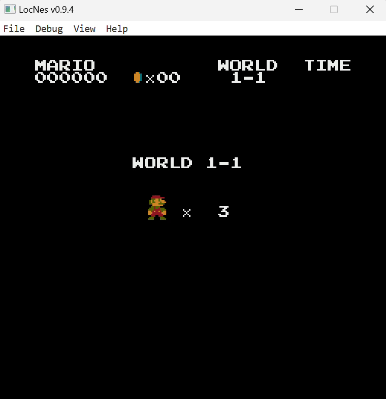
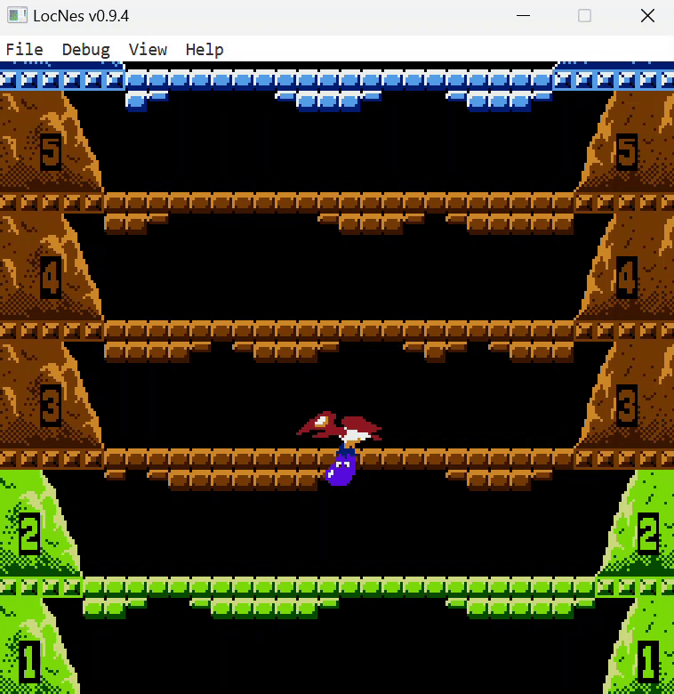
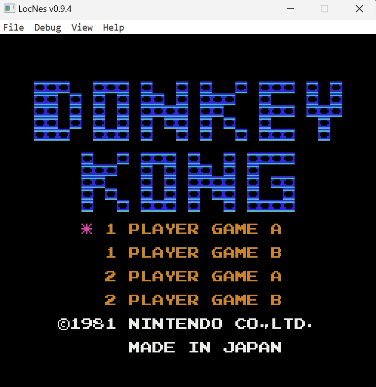
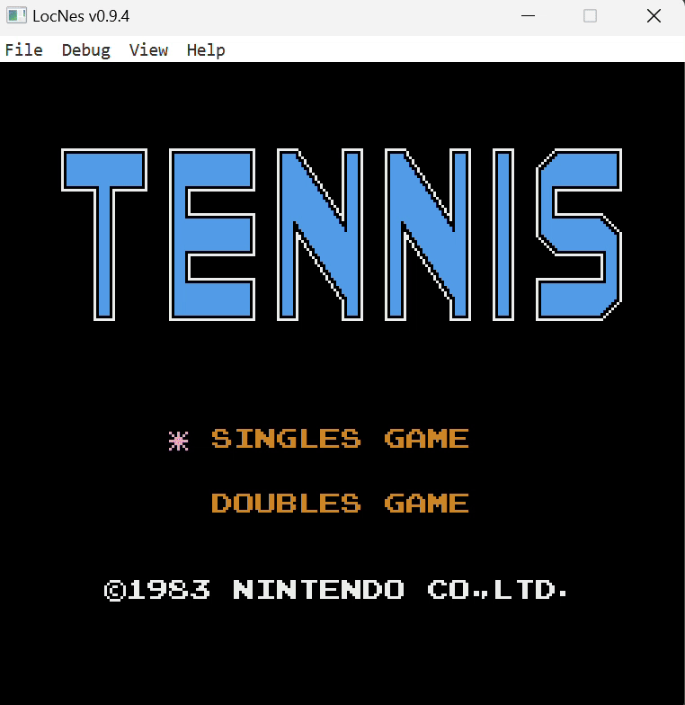

# LocNes

**LocNes** is a Java-based NES emulator focused on accuracy, modular design, and ease of debugging. Built from scratch, it emulates the 6502 CPU, PPU rendering, and supports real-time graphical inspection of pattern tables and nametables using a JavaFX interface.

<table align="center">
  <tr>
    <td align="center" style="padding: 10px;">
      <br>
      <sub><b>Super Mario Bros</b></sub>
    </td>
    <td align="center" style="padding: 10px;">
      <br>
      <sub><b>Ice Climber</b></sub>
    </td>
  </tr>
  <tr>
    <td align="center" style="padding: 10px;">
      <br>
      <sub><b>Donkey Kong</b></sub>
    </td>
    <td align="center" style="padding: 10px;">
      <br>
      <sub><b>Tennis</b></sub>
    </td>
  </tr>
</table>

## Features

- Accurate 6502 CPU emulation verified against official test suites
- PPU rendering with support for pattern tables, nametables, palettes
- Debug window for live visualization of background tiles
- JavaFX-based interface with optional fullscreen mode
- Opcode-level unit testing with JUnit and JSON-based test data

## Requirements

- Java 17 or higher
## Running the Emulator

### 1. Clone the Repository

```bash
git clone https://github.com/priyanshu-2612/LocNes.git
cd LocNes
```

### 2. Run with Maven

Use the built-in Maven wrapper:

```bash
./mvnw javafx:run       # For Linux/macOS
mvnw.cmd javafx:run     # For Windows
```

## Usage

- Use the **File → Open** menu to select a `.nes` ROM file
- Toggle the debug view via keyboard shortcuts or UI controls
- Use `Ctrl + F` to hide the menu bar and maximize canvas space
> *Note: The `Ctrl + F` shortcut to hide the menu bar is currently under maintenance.*
### Input Controls

LocNes maps keyboard keys to the NES controller as follows:

| NES Button    | Keyboard Key |
|--------------|---------------|
| A            | X             |
| B            | Z             |
| Start        | Enter         |
| Select       | Right Shift   |
| D-Pad Up     | Up Arrow      |
| D-Pad Down   | Down Arrow    |
| D-Pad Left   | Left Arrow    |
| D-Pad Right  | Right Arrow   |

Keyboard input works automatically when the game window is in focus.

## Limitations

- Currently supports only **Mapper 0 (NROM)** ROMs
- No audio support yet
- Emulator does not currently support saving or restoring game state

## Planned Improvements

The following enhancements are planned for future releases of LocNes:

- **Mapper Expansion**: Support for popular mappers like MMC1, UxROM, and CNROM.
- **Audio Emulation**: Implementation of APU channels and audio timing.
- **Save States**: Quick save/load of emulator state.
- **Performance Enhancements**: Optimized rendering and memory access paths.
- **CLI Mode**: Enable running the emulator directly from the terminal without a GUI, useful for automation and testing.
- **Cross-Platform Distributions**: Self-contained executables for major OSes.

## Want to contribute?

Emu dev is a lonely excursion and LocNes has a large supply of issues and functionalities to be implemented, if you wish to contribute to this project I would be more than happy. You can mail me to know more about the project.

**Email:** [priyanshu.sharma2612@gmail.com](mailto:priyanshu.sharma2612@gmail.com)

